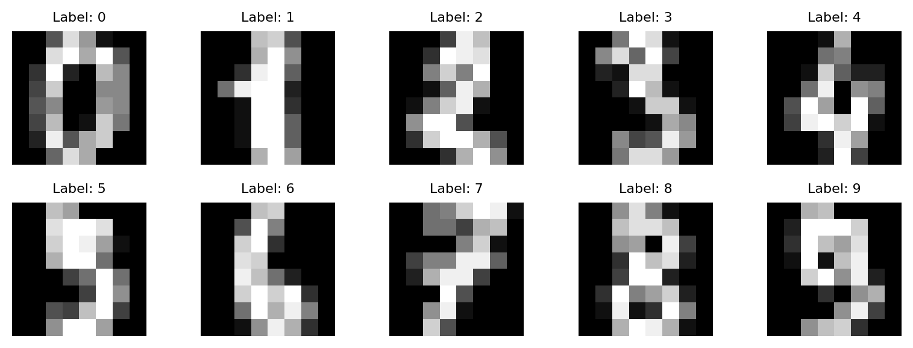
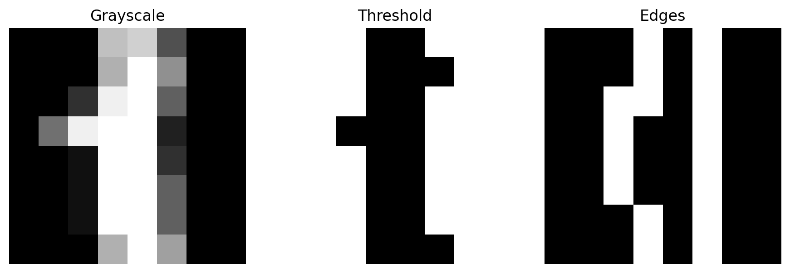
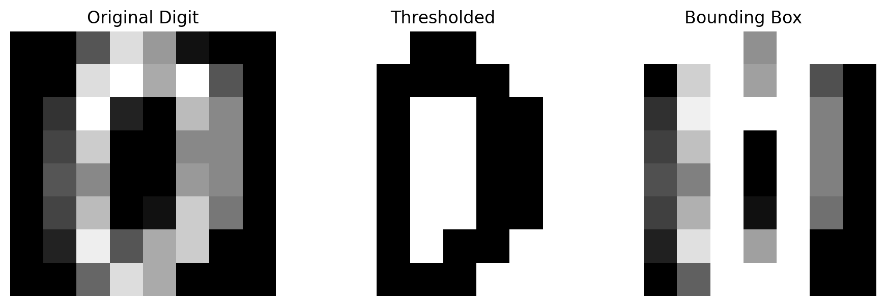

<a id="readme-top"></a>

<h1 align="center">OpenCV Feature Extraction</h1>

<p align="center">
  OpenCV-based feature extraction for visual data analysis and handwritten digit classification.
</p>

<p align="center">
  
  
  
  
</p>
<br>

## Table of Contents

1. [Overview](#overview)  
2. [Key Features](#key-features)  
3. [Getting Started](#getting-started)  
4. [Usage](#usage)  
5. [Technical Details](#technical-details)  
6. [Feature Extraction Pipeline](#feature-extraction-pipeline)  
7. [License](#license)

<br>

## Overview

This project focuses on implementing OpenCV-based feature extraction techniques for visual data analysis and handwritten digit classification.

The main objective is to explore how raw image data can be transformed into meaningful feature representations using classical image processing methods.

The project demonstrates:

- Image preprocessing and transformation  
- Feature extraction techniques  
- Visual data representation  
- Application to digit classification tasks  

<p align="center">
  
</p>

<p align="center">
  Sample handwritten digit inputs used in the project.
</p>

<br>
<p align="right">(<a href="#readme-top">back to top</a>)</p>
<br>

## Key Features

| Feature | Description |
|--------|------------|
| Image Processing | Preprocessing and transformation of raw images |
| Feature Extraction | Extraction of meaningful visual features using OpenCV |
| Data Representation | Conversion of images into structured feature vectors |
| Digit Analysis | Application to handwritten digit data |
| Notebook Workflow | Interactive experimentation using Jupyter Notebook |

<br>
<p align="right">(<a href="#readme-top">back to top</a>)</p>
<br>

## Getting Started

### Prerequisites

- Python 3.8+
- Jupyter Notebook
- pip

<br>

### Install required libraries:

```bash
pip install opencv-python numpy matplotlib
```

### Run the notebook:

```bash
jupyter notebook
```

### Open:

```bash
image_processing.ipynb
```

<br>
<p align="right">(<a href="#readme-top">back to top</a>)</p>
<br>

## Usage

1. Open the notebook  
2. Run cells step-by-step  
3. Observe preprocessing operations  
4. Analyze extracted features  
5. Understand how features contribute to classification  

<br>
<p align="right">(<a href="#readme-top">back to top</a>)</p>
<br>

## Technical Details

### Libraries Used

- OpenCV → image processing and feature extraction  
- numpy → numerical operations  
- matplotlib → visualization  

<br>

### Core Techniques

- Image normalization  
- Thresholding  
- Edge detection  
- Feature vector generation  
- Basic classification workflow  

<br>

<p align="center">
  
</p>

<p align="center">
  Preprocessing steps including thresholding and edge detection.
</p>

<br>
<p align="right">(<a href="#readme-top">back to top</a>)</p>
<br>

## Feature Extraction Pipeline

The overall workflow of the project:

1. Load image data  
2. Apply preprocessing (grayscale, resizing, normalization)  
3. Extract features using OpenCV techniques  
4. Convert features into structured vectors  
5. Use extracted features for analysis or classification  

<br>

<p align="center">
  
</p>

<p align="center">
  Example of feature extraction applied to handwritten digit data.
</p>

<br>
<p align="right">(<a href="#readme-top">back to top</a>)</p>
<br>

## License

This project is licensed under the MIT License.  
See the [LICENSE](LICENSE) file for details.

<p align="right">(<a href="#readme-top">back to top</a>)</p>
